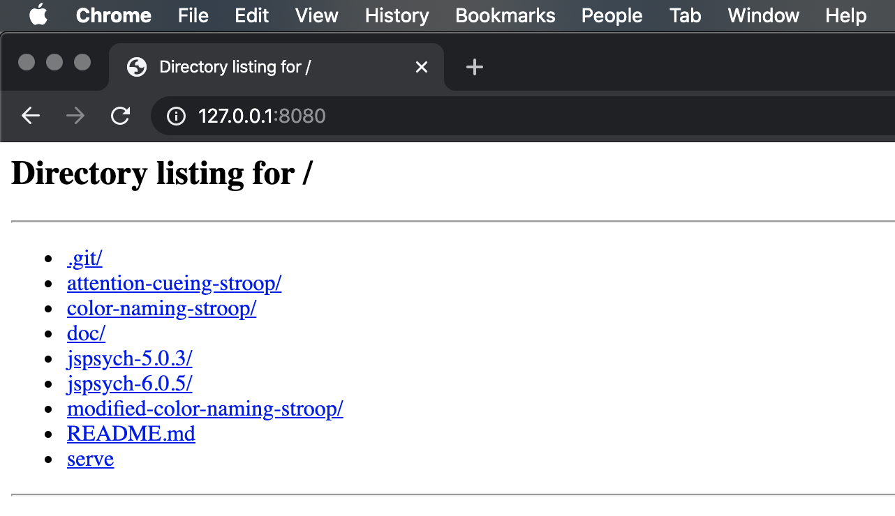

# jsPsych-tasks

Three tasks designed by the UR YR2 lab implemented in JS using the JsPsych API [https://www.jspsych.org/] + Princeton Timed Text Plugin [https://github.com/PrincetonUniversity/prsonlab/wiki/jsPsych-Plugins#jspsych-text-timed]

### Instructions [terminal] \& dependencies:

 - Python [2.7 / 3. Needed for HttpServer - otherwise do \*]
 - JsPsych 5.0.3 [submodule]

Clone this repository
```
git clone --recurse-submodules https://github.com/choltz95/jsPsych-tasks.git
```

Instantiate an instance of PyServer(\*since the tasks are written in pure JS, you can also open Index.html files in your browser.)
```
./serve
```

Navigate to the url in your browser
```
127.0.0.1:8080
```

Select which task to run!




### Overview of tasks:

Task 1. Color naming stroop: fixation & word blocks w/ different colors response dependant on color

Task 2. Color naming stroop \'modified\': fixation & word blocks w/ different colors response dependant on color alternate timing profile

Task 3. Attention cueing stroop: fixation & dot & word blocks response dependant on dot location

### Issues:

Some nonstandard fixes are applied to JsPsych. These tasks may not work with the officially supported JsPsych API.

Some poor scaling of fonts and boxes in embedded IFrames - included iframe.html for diagnosis. 

### Notes on embedding tasks:

Embedding tasks in SurveyGizmo has no official support. It is done via API and forced delay.

Embedding tasks in Qualtrics has no official support. It is done via embedded IFrames and querying their EmbeddedData api. See:

https://www.qualtrics.com/support/survey-platform/survey-module/survey-flow/standard-elements/embedded-data/

https://www.qualtrics.com/community/discussion/4024/postmessage-from-jspsych-in-iframe-to-qualtrics

https://groups.google.com/forum/#!topic/jspsych/k4isLHLmf1s

https://pavlov.tech/2014/10/22/mturk-and-qualtrics/

